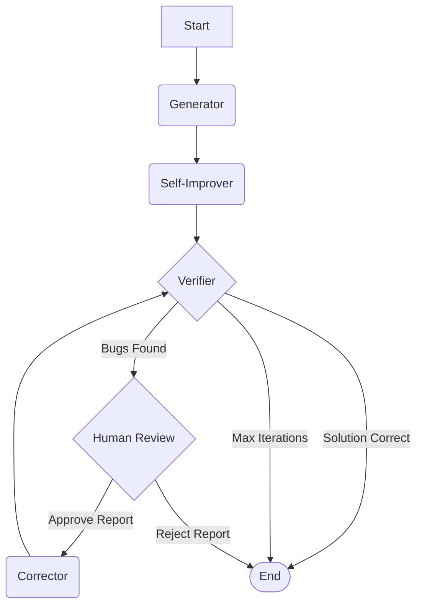

# MIO: A Multi-Agent AI System for Solving IMO Problems

[](https://opensource.org/licenses/MIT)

This repository contains a Python-based implementation of a sophisticated multi-agent AI system designed to solve complex mathematical problems, specifically those from the International Mathematical Olympiad (IMO).

The core idea, inspired by recent AI research, is to move beyond single-shot AI calls and instead create a collaborative team of specialized AI "agents." These agents work together in an iterative cycle of generation, verification, and correction to produce rigorous and accurate mathematical proofs.

The entire workflow is orchestrated using **LangGraph**, a library for building stateful, multi-agent applications.

## 🏛️ Architecture

The system is designed as a stateful graph where each node is an "agent" with a specific role. These agents communicate and share information through a central `GraphState` object.

### The Agent Team

The `main.py` script utilizes the following agents:

1.  **🧠 Generator**: The initial solver. It takes the problem statement and produces the first detailed draft of a solution.
2.  **🔄 Self-Improver**: A crucial refinement step. This agent reviews the Generator's output, using an additional "thinking budget" to enhance clarity, fill potential gaps, and improve rigor *before* verification.
3.  **🔍 Verifier**: The meticulous critic. Its sole purpose is to find flaws in the proposed solution. It does not solve the problem itself but produces a structured "bug report" detailing any logical errors or justification gaps.
4.  **👤 Human Reviewer**: The quality gate. This "human-in-the-loop" step presents the Verifier's bug report to the user for approval. This prevents the AI from getting stuck trying to fix a misunderstood or non-existent error.
5.  **🔧 Corrector**: The reviser. If the bug report is approved, this agent takes the original solution and the report and generates a new, corrected version.

### The Workflow

The agents collaborate in a cyclical process orchestrated by LangGraph:



1.  The `Generator` creates a solution.
2.  The `Self-Improver` refines it.
3.  The `Verifier` checks the refined solution.
4.  **Decision**:
    - If correct, the process ends.
    - If flawed, the `Human Reviewer` is prompted.
5.  **Decision**:
    - If the human approves the bug report, the `Corrector` attempts a fix.
    - If the human rejects it, the process ends.
6.  The corrected solution is sent **back to the Verifier**, and the loop continues.

## ✨ Key Features

*   **Multi-Agent Collaboration**: Leverages specialized agents for a robust problem-solving process.
*   **Iterative Refinement**: The generate-verify-correct loop allows the system to improve its own work.
*   **Interactive Model Selection**: Choose between faster or more powerful Gemini models at runtime.
*   **Robust API Setup & Connection Testing**: Provides clear guidance for API key setup and verifies the connection before starting.
*   **Human-in-the-Loop**: A pragmatic control point to guide the AI and prevent dead-ends.
*   **Structured I/O with Pydantic**: Ensures reliable, predictable data flow between agents.
*   **Verbose Logging & Error Handling**: Provides clear, real-time insight into the "thinking process" of each agent and helpful suggestions on errors.

## 📂 File Description

*   `main.py`: The primary, most up-to-date script for running the multi-agent workflow. It includes all the latest features like model selection and enhanced error handling.

## 🚀 Getting Started

### 1. Prerequisites

Ensure you have Python 3.8+ installed.

### 2. Clone the Repository

```bash
git clone https://github.com/your-username/your-repo-name.git
cd your-repo-name
```

### 3. Install Dependencies

The project uses a few key packages. You can install them directly:

```bash
pip install langchain langgraph langchain-google-genai python-dotenv pydantic
```

### 4. Set Up Your API Key

This project uses the Google Gemini API.

1.  Obtain an API key from Google AI Studio.
2.  Create a file named `.env` in the root of the project directory.
3.  Add your API key to the `.env` file. **Make sure there are no quotes or extra characters.**
    ```
    GOOGLE_API_KEY=your_api_key_here
    ```

The script will automatically load this key. If it fails, it will provide instructions and prompt you to enter the key manually.

## 🏃 How to Run

To run the workflow, execute the `main.py` script:

```bash
python main.py
```

### Step 1: Select a Model

You will first be prompted to choose which Gemini model to use for the task.

```
🤖 MODEL SELECTION
==================================================
Please select the Gemini model you would like to use:
1. Gemini 2.0 Flash - Faster responses, good for general tasks
2. Gemini 2.5 Pro - More capable reasoning, better for complex mathematics
==================================================
Enter your choice (1 or 2): 2
```

The script will then test the API connection with your chosen model.

### Step 2: Enter a Problem

Next, enter the mathematical problem you want to solve. You can paste your own or press Enter to use the default IMO "windmill" problem.

### Step 3: Interact with the Workflow

During the run, you will see detailed output from each agent. If the `Verifier` finds issues, you will be prompted to approve or reject its findings:

```
🎯 DECISION REQUIRED:
Do you agree with the verifier's assessment?
• Type 'y' to APPROVE the bug report and proceed with correction
• Type 'n' to REJECT the bug report and end the workflow

👤 Your decision (y/n): y
```

At the end of the process, a comprehensive final report is generated, summarizing the problem, the workflow, and the final proposed solution.

## 💡 Contributing

Contributions are welcome! Here are some ideas for potential improvements:

*   **Parallel Generation**: Implement a "Generator" that creates multiple candidate solutions, followed by a "Ranker" agent to select the most promising one.
*   **Tool Usage**: Allow agents to use tools like a Python interpreter for symbolic math calculations (`sympy`).
*   **Web UI**: Build a simple web interface using Streamlit or Flask to make the process more interactive.
*   **Model Flexibility**: Abstract the LLM initialization to easily switch between different model providers (e.g., Anthropic, OpenAI).

Feel free to open an issue or submit a pull request.

## 📄 License

This project is licensed under the MIT License. See the `LICENSE` file for details.

